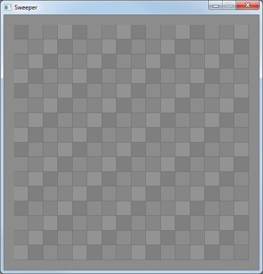
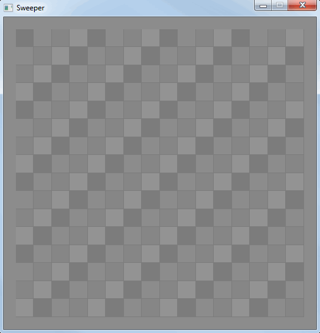
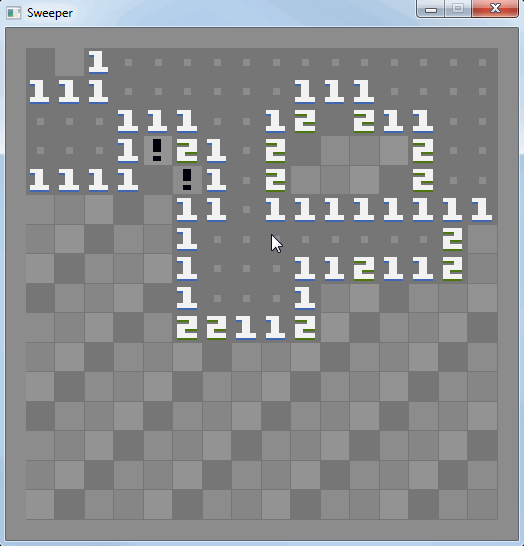
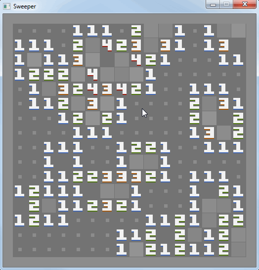
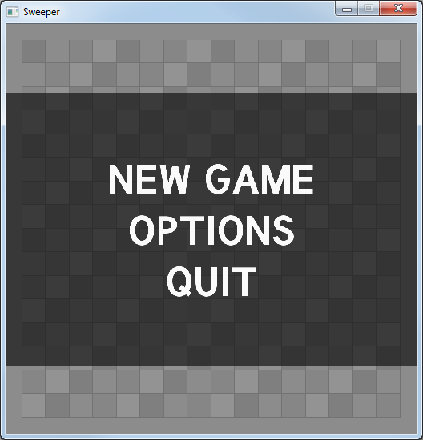
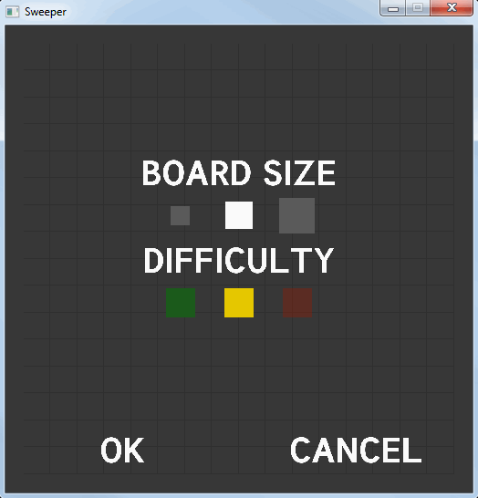

# Sweeper

Sweeper was written by Sophie Kirschner (sophiek@pineapplemachine.com) using [mach](https://github.com/pineapplemachine/mach.d/releases/tag/v0.1.0). It is distributed under the zlib/libpng license.

It uses the [Tuffy](https://www.fontsquirrel.com/fonts/tuffy) font, which was created by Thatcher Ulrich.

## Building Sweeper

In addition to [mach v0.1.0](https://github.com/pineapplemachine/mach.d/releases/tag/v0.1.0), Sweeper also depends on [DerelictSDL2](https://github.com/DerelictOrg/DerelictSDL2), [DerelictGL3](https://github.com/DerelictOrg/DerelictGL3), and [DerelictUtil](https://github.com/DerelictOrg/DerelictUtil).

To compile from source using rdmd, run the command:

`rdmd -I"path/to/mach.d" -I"path/to/derelict/deps" sweeper.d`

Your system will need to have SDL2 dynamic libraries available in order to run Sweeper, once compiled. Those libraries can be found [here](https://www.libsdl.org/download-2.0.php) and [here](https://www.libsdl.org/projects/).
Sweeper requires at least the core SDL2 dynamic library plus the SDL_image and SDL_ttf extensions.

## Playing Sweeper

If you're on Windows, you should be able to just run `sweeper.exe`.
On other platforms, you will have to build from source.
(Instructions are above.)

When you first start Sweeper, your personal computer monitor will look something like this:

When you move the mouse over a tile, the tile is highlighted to show that it's selected.
You can left-click to reveal selected tiles, and you can right-click to flag or de-flag them...

The numbers say how many mines are adjacent to each tile.
If you reveal a mine, you lose the game! Use logic to figure out which tiles
have mines and which don't!

And if you reveal all the tiles which _aren't_ mines, you win!

But don't worry if you lose, when the game ends you can click anywhere to begin
again.

You can also change how you play the game by pressing the `escape` key, which
brings up the menu!

Here you can start a **new game** with all fresh, unrevealed tiles, you can
**quit** the game, or you can open the **options** menu.
You can also return to your game by pressing `escape` again!

If your sweeping adventure takes you into the options menu, you'll find that
you can change the number of tiles in the board and the difficulty of winning
the game.
You can click the words to change the settings — a bigger board means more tiles,
and a higher difficulty means more mines!

Are you in a hurry? Is something important calling you away from your personal
computer? Don't worry! When you exit the game, your current game is saved so
that you can return to it when you boot up your personal computer and start
Sweeper again.

**Most importantly, have fun!**
